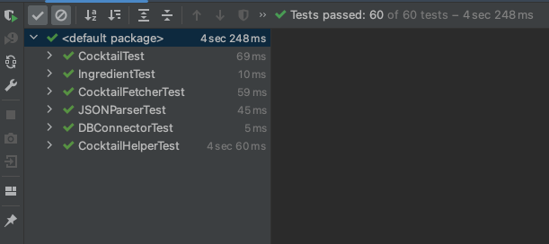

# Assignment 1 - Test-Driven Development

**Overview**

The objective of this task is to develop a command-line program while adhering to the principles of test-driven development.

I have successfully built a program that allows users to input choices from a menu and retrieve relevant details about cocktails or ingredients. The concept and design of the program were my own, and I utilized the APIs provided by cocktailDB (https://www.thecocktaildb.com/api.php) to retrieve the required data.

I hope that you will be able to find the cocktail details you are searching for! Cheers!

**Checklist**

- [x] **800+ lines** of code (Excluding test cases) :tada:
- [x] Test coverage with **1:1 mapping** of functions (**44 test cases** in total)
- [x] Follow Test-Driven Development
- [x] Command line program with user interaction
- [x] Should compile in local system
- [x] Must include DB interaction for mocking database
- [x] Include a readme file with clear instructions

**Instructions**

When you first compile and run the program, you will see a menu that displays as below - 

If you want to fetch a random cocktail you can select the **1** option to proceed, and the output is something like below - 

The above gives the data about a random cocktail including the instructions on how to prepare it.

Let's say you want to get a cocktail by name, you can choose the **2** option and enter a cocktail name to search, example : Margarita.

The above shows how it was able to provide the details for the cocktail we searched for. But if we search for a cocktail that is not present in the DB or an invalid name then we get the following output - 

Similarly, we can get ingredient details as well. We can select the option 8 if we want to search by name, example: Gin.

The above details has the type, Alcohol by volume and other details as well.

**Test Coverage**

There is a mapping for all the functions spread over different classes. All the base classes have been covered for test cases as well.
Below is the test files structure -

There are a total of **44** test cases & it covers all the test scenarios in and out. The test cases have been verified during development and the below is the screenshot of the passed and total test scenarios covered.

